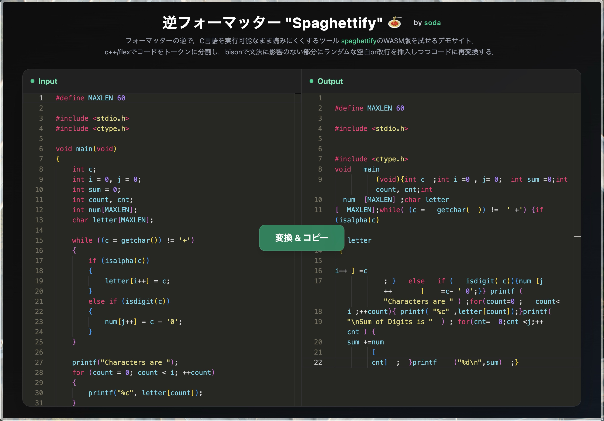

# spaghettify

フォーマッターの逆で，C言語を実行可能なまま読みにくくするツール "spaghettify"と，それをWeb上で試せるデモサイト．
c++/flexでコードをトークンに分割し，bisonで文法に影響のない部分にランダムな空白or改行を挿入しつつコードに再変換するCLIツールとして実装されている．

## デモサイト
#### https://sodahub99k.github.io/spaghettify/

画面左側`Input`にC言語コードを入力し，画面中央の`変換&コピー`ボタンを押すと，右側`Output`にspaghettifyされたコードが表示される．

## リポジトリ構成
- `spaghettify-cli/...` - spaghettifyのCLIツール
- `src/...` - spaghettifyのデモサイト

## ビルド方法
1. `spaghettify-cli`ディレクトリに移動し，`make`でビルド

## 使用例
1. `bin/spaghettify example/input.c` -> `input_spaghettified.c` というファイルが生成される
2. `gcc example/input.c -o example/input && ./example/input` (元のコードのコンパイル&実行)
3. `gcc example/input_spaghettified.c -o example/input_spaghettified && ./example/input_spaghettified` (spaghettifyされたコードのコンパイル&実行)
  
-> 元のコードと同じ出力が得られるはず